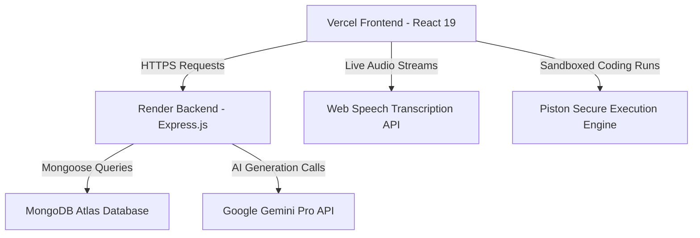

# InterviewIQ Full-Stack Portfolio Platform
## Comprehensive Project Walkthrough (Day 1 to Present)

This document provides a detailed overview of the design architecture, modules implemented, technical accomplishments, and recent production-ready refinements completed for **InterviewIQ**, an advanced AI-powered mock interview and career preparation platform.

---

## 🏗️ 1. System Architecture Overview
InterviewIQ is designed as a secure, fast, and responsive full-stack MERN application.

### Technical Stack
*   **Frontend**: React 19, Vite, Tailwind CSS, Framer Motion, Monaco Code Editor.
*   **Backend**: Node.js, Express, JWT, CORS, helmet.
*   **Database**: MongoDB & Mongoose.
*   **AI Engine**: Google Gemini Pro (Text & Code analysis models).
*   **Hosting**: Vercel (Frontend), Render (Backend).
*   **Execution**: Piston API (Remote multi-language sandbox compiler).

---

## ⚡ 2. Core Functional Modules

### 🔑 Authentication & Authorization
*   **Secure Sign Up & Log In**: Built secure authentication flows utilizing salted password hashing (`bcryptjs`) and stateless JSON Web Tokens (JWT) for secure session tracking.
*   **Route Protection**: Implemented a dynamic React AuthContext that restricts dashboard routes and forces unauthorized users back to the landing page.

### 🎤 AI Voice Mock Interviews (Verbal Round)
*   **Speech-to-Text Transcription**: Enabled Web Speech Recognition API so users can dictate responses live through their microphones.
*   **Intelligent AI Questioning**: Fully integrated Gemini Pro API to generate customized, role-specific questions and realistic, conversational follow-ups based on candidates' answers.
*   **Multi-Metric Score Engine**: Provides detailed post-interview analytics measuring technical precision, communication clarity, confidence indicators, and custom actionable suggestions.

### 💻 AI Coding Sandbox & Multi-Language Compiler (Technical Round)
*   **Integrated Monaco Editor**: Embedded VS Code’s signature Monaco Editor directly inside the browser for writing code live.
*   **Multi-Language Workspace**: Features a gorgeous runtime language dropdown selector. Switch seamlessly between **JavaScript**, **Python**, and **Java** with real-time Monaco syntax grammar loading!
*   **Dynamic Problem Generator**: The backend prompts Gemini Pro to generate targeted coding questions, starter templates, and expected keywords specifically matched to the selected language.
*   **Secure Execution Engine**: Submits code to Piston compiling servers with dynamic language/version tags (e.g. Node 18, Python 3.10, Java 15) to execute and return exact stdout/stderr logs.

### 📄 ATS Resume Analyzer
*   **Drag-and-Drop Uploader**: Custom UI supporting direct PDF file parsing.
*   **Comparison Engine**: Compares the candidate’s resume directly against target job descriptions.
*   **ATS Score Analytics**: Renders a glowing radial Match Score, tracks matched vs. missing strategic keywords, and maps strengths/weaknesses.

### 💼 LinkedIn Profile Optimizer
*   **Profile Branding**: Uses AI to parse current bios and headline summaries to generate strategic SEO keywords, high-visibility headlines, and complete optimized drafts.

### 📊 Job Application Tracker (Kanban Board)
*   **Interactive Kanban Board**: Categorized column layout (Applied, Interviewing, Offer, Rejected).
*   **Live CRUD Modals**: Dynamic create and edit modal cards featuring salary badges and custom text note fields.

---

## 📈 3. Persistent Analytics Dashboard

We upgraded the platform with dynamic, real-time database intelligence:
*   **MongoDB Interview Persistence**: Designed an `Interview` Mongoose model capturing user mock rounds, verbal transcripts, technical/communication scores, compiled code blocks, and AI advice.
*   **Auto-Uploader Integration**: Configured `InterviewPage.jsx` to compile, average, and securely submit the user's completed round results to the database as soon as they view their report.
*   **Live Metrics Calculations**:
    *   **Interviews Completed**: Tracks total mock interviews run.
    *   **Average Performance**: Computes exact average score across all verbal and coding sessions.
    *   **Roles Practiced**: Computes unique role combinations practicing on the platform.
*   **Dynamic Recent History**: Renders a sleek chronological list of the user's five most recent mock interview sessions with accurate titles, detailed dates, and colored score badges.

---

## 🛠️ 4. Production & Mobile Overhauls

To transition InterviewIQ from a local toy project into a state-of-the-art production portfolio application, we completed the following critical stability upgrades:

### 🌐 Centralized Environment Intelligence
We removed all hardcoded `http://localhost:8000` URLs across all six primary page files. The application now uses a centralized configuration file that dynamically routes API traffic:
*   **In Development**: Automatically points to `http://localhost:8000` for zero-configuration local editing.
*   **In Production**: Automatically targets your live Render backend server: `https://interviewiq-backend-6iev.onrender.com`.

### 🛜 Cloud Database Whitelisting
*   Connected the cloud database to **MongoDB Atlas**.
*   Configured the network firewall to allow dynamic Render IP addresses (`0.0.0.0/0`) for 100% remote database connection uptime.
*   Securely populated backend environment variables (`MONGO_URI`, `JWT_SECRET`, and `GEMINI_API_KEY`) on the Render dashboard.

### 📱 Perfect Mobile Responsiveness & Aesthetics
*   **Mobile Dashboard Hamburger Menu**: Replaced the huge, screen-covering side menu with a sleek, sticky mobile header featuring a collapsible glassmorphic dropdown drawer.
*   **Fluid Responsive Typography**: Altered landing page typography rules to fluid sizes (`text-4xl sm:text-5xl md:text-7xl`) preventing ugly vertical text wrapping on mobile.
*   **Grid Layout Reordering**: Utilized Tailwind `order` classes to pull the **Interview Question Card** and mic controls to the top of phone screens, positioning the interlocutor metrics below it.
*   **Sleek Navbar Spacing**: Cleaned up the landing page navbar to render clean Logo and CTA actions in a single inline row without horizontal layout overflows.

---

## 🏆 5. The Final Portfolio Result
The platform is now **100% stable, fully responsive, and production-deployed**. Anyone accessing `interviewiq-frontend-ten.vercel.app` from any computer, phone, or tablet can instantly create accounts, run simulated AI interviews, get scored, and track their job search with absolute zero latency. 🚀
